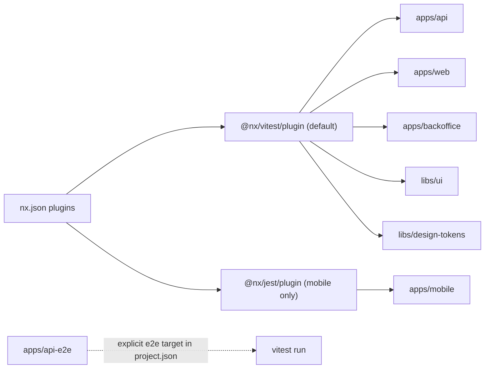

# Migrate Jest to Vitest

## Overview

Migrate all Nx projects from Jest to Vitest using the official `@nx/vitest` plugin, while keeping Jest only for `apps/mobile` (Expo/React Native, where Vitest is not viable). Replaces 6 jest configs with vitest configs, swaps Nx plugin wiring, prunes Jest-only dependencies, and converts `apps/api-e2e` to a Vitest-based e2e target.

## Scope

Migrate to Vitest:

- `apps/api` (NestJS, node)
- `apps/api-e2e` (NestJS e2e, node, has globalSetup/globalTeardown)
- `apps/web` (Next.js, jsdom)
- `apps/backoffice` (Next.js, jsdom)
- `libs/ui` (node)
- `libs/design-tokens` (node)

Keep on Jest:

- `apps/mobile` (Expo/React Native, `jest-expo` preset). It uses `jest.mock(...)` in `apps/mobile/src/test-setup.ts` and Expo doesn't ship Vitest support.

## Target Architecture



`apps/api-e2e` keeps its custom `e2e` target (with `dependsOn: api:build, api:serve`) but invokes Vitest via `nx:run-commands`, so the inferred plugin doesn't double-create a target.

## Dependency changes (`package.json`)

Add (devDependencies):

- `vitest`, `@vitest/coverage-v8`, `@vitest/ui`
- `@nx/vitest`
- `@vitejs/plugin-react` (web, backoffice)
- `vite-tsconfig-paths` (honor `tsconfig.base.json` aliases everywhere)
- `jsdom` (web, backoffice)
- `unplugin-swc` (NestJS decorator metadata for `apps/api` and `apps/api-e2e`)

Remove:

- `jest`, `jest-environment-jsdom`, `jest-environment-node`, `jest-util`
- `ts-jest`, `babel-jest`, `@swc/jest`, `@types/jest`

Mobile-only deps (`jest-expo`, `babel-jest`) remain declared in `apps/mobile/package.json`. If removing `jest`/`@types/jest` from the root breaks mobile, re-add them under `apps/mobile/package.json` only.

## File changes

### 1. `nx.json`

- Remove the existing `@nx/jest/plugin` block.
- Re-add `@nx/jest/plugin` scoped to mobile only:

```json
{
  "plugin": "@nx/jest/plugin",
  "include": ["apps/mobile/**/*"],
  "options": { "targetName": "test" }
}
```

- Add `@nx/vitest/plugin`, excluding mobile and api-e2e:

```json
{
  "plugin": "@nx/vitest/plugin",
  "exclude": ["apps/mobile/**/*", "apps/api-e2e/**/*"],
  "options": {
    "testTargetName": "test",
    "ciTargetName": "test-ci",
    "testMode": "run"
  }
}
```

- `targetDefaults.test`: drop `command: node ../../node_modules/jest/bin/jest.js`. Vitest plugin handles invocation; mobile inherits via `@nx/jest`. Keep `dependsOn: ["^build"]` if desired.
- `namedInputs.production`: also exclude `vitest.config.[jt]s` alongside the existing `jest.config.[jt]s` ignore.

### 2. Root configs

Delete `jest.config.ts` and `jest.preset.js`. Mobile's `jest-expo` preset doesn't depend on them.

### 3. Per-project Vitest configs

#### `apps/api/vitest.config.ts` (NestJS, node)

```ts
import { defineConfig } from 'vitest/config';
import swc from 'unplugin-swc';
import tsconfigPaths from 'vite-tsconfig-paths';

export default defineConfig({
  plugins: [
    tsconfigPaths(),
    swc.vite({
      module: { type: 'es6' },
      jsc: {
        parser: { syntax: 'typescript', decorators: true },
        transform: { decoratorMetadata: true, legacyDecorator: true },
      },
    }),
  ],
  test: {
    globals: true,
    environment: 'node',
    include: ['src/**/*.{test,spec}.ts'],
    coverage: {
      provider: 'v8',
      reportsDirectory: '{projectRoot}/test-output/vitest/coverage',
    },
  },
});
```

#### `libs/ui/vitest.config.ts` and `libs/design-tokens/vitest.config.ts`

```ts
import { defineConfig } from 'vitest/config';
import tsconfigPaths from 'vite-tsconfig-paths';

export default defineConfig({
  plugins: [tsconfigPaths()],
  test: {
    globals: true,
    environment: 'node',
    include: ['src/**/*.{test,spec}.ts'],
    coverage: {
      provider: 'v8',
      reportsDirectory: '{projectRoot}/test-output/vitest/coverage',
    },
  },
});
```

#### `apps/web/vitest.config.ts` and `apps/backoffice/vitest.config.ts` (Next.js, jsdom)

```ts
import { defineConfig } from 'vitest/config';
import react from '@vitejs/plugin-react';
import tsconfigPaths from 'vite-tsconfig-paths';

export default defineConfig({
  plugins: [react(), tsconfigPaths()],
  test: {
    globals: true,
    environment: 'jsdom',
    include: ['{src,specs}/**/*.{test,spec}.{ts,tsx}'],
    coverage: {
      provider: 'v8',
      reportsDirectory: '{projectRoot}/test-output/vitest/coverage',
    },
  },
});
```

#### `apps/api-e2e/vitest.config.ts`

```ts
import { defineConfig } from 'vitest/config';
import swc from 'unplugin-swc';

export default defineConfig({
  plugins: [swc.vite()],
  test: {
    globals: true,
    environment: 'node',
    include: ['src/**/*.{test,spec}.ts'],
    globalSetup: ['src/support/global-setup.ts'],
    setupFiles: ['src/support/test-setup.ts'],
    coverage: {
      provider: 'v8',
      reportsDirectory: '{projectRoot}/test-output/vitest/coverage',
    },
  },
});
```

Convert `apps/api-e2e/src/support/global-setup.ts` from CJS to Vitest's `globalSetup` shape (default export returning teardown):

```ts
import { waitForPortOpen, killPort } from '@nx/node/utils';

export default async function () {
  const host = process.env.HOST ?? 'localhost';
  const port = process.env.PORT ? Number(process.env.PORT) : 3000;
  await waitForPortOpen(port, { host });
  return async () => {
    await killPort(port);
  };
}
```

Then delete `apps/api-e2e/src/support/global-teardown.ts` (folded into the returned teardown).

Update the `e2e` target in `apps/api-e2e/package.json`:

```json
{
  "executor": "nx:run-commands",
  "outputs": ["{projectRoot}/test-output/vitest/coverage"],
  "options": { "command": "vitest run --config={projectRoot}/vitest.config.ts" },
  "dependsOn": [
    "@hannature-system/api:build",
    "@hannature-system/api:serve"
  ]
}
```

### 4. `tsconfig.spec.json` per migrated project

For each migrated project's `tsconfig.spec.json`:

- Replace `"types": ["jest", "node"]` with `"types": ["vitest/globals", "node"]`.
- In `include`, swap `jest.config.{ts,cts}` for `vitest.config.ts`.

`apps/mobile/tsconfig.spec.json` stays on `jest`.

### 5. Spec source files

Existing specs only use `describe / it / test / expect`. With `globals: true` no code changes needed. Only `jest.mock` usage in the repo lives in `apps/mobile/src/test-setup.ts` (kept on Jest).

### 6. ESLint

`eslint.config.mjs` has no Jest-specific rules; no changes required.

## Verification

After each project migration:

- `nx show project <name>` shows an inferred `test` target pointing at vitest.
- `nx test <name>` passes locally.
- `nx run-many -t test` passes across the repo.
- `nx test mobile` still runs `jest-expo`.
- `nx e2e api-e2e` still works via the explicit target.

## Risks & Gotchas

- NestJS decorators: `unplugin-swc` is mandatory; without it DI metadata breaks (Vitest does not pick up `.swcrc` automatically the way `@swc/jest` did).
- `next/jest` did automatic mocking of CSS Modules / static assets. Current Next.js specs don't import any, so plain Vitest suffices; revisit if specs grow.
- `apps/mobile`'s `jest.mock` confirms why mobile must stay on Jest.
- `@nx/vitest` requires Nx >= 21 (we are on 22.6.5) and supports vitest 1-4.
